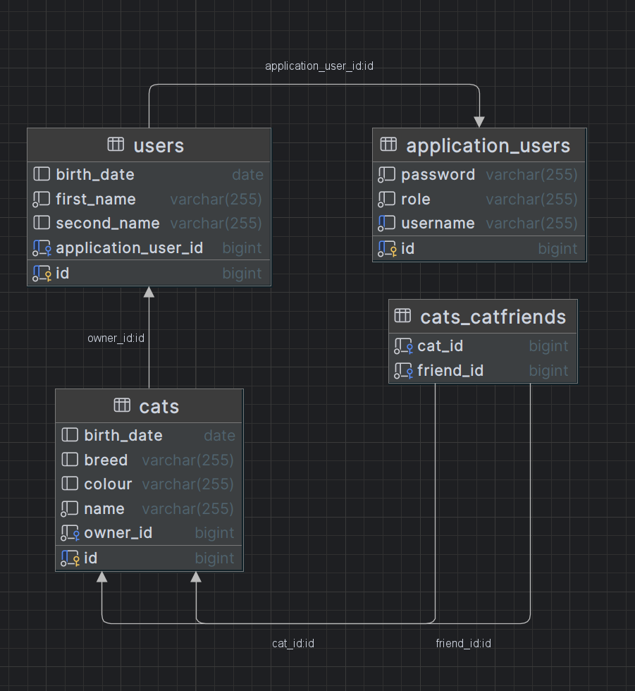
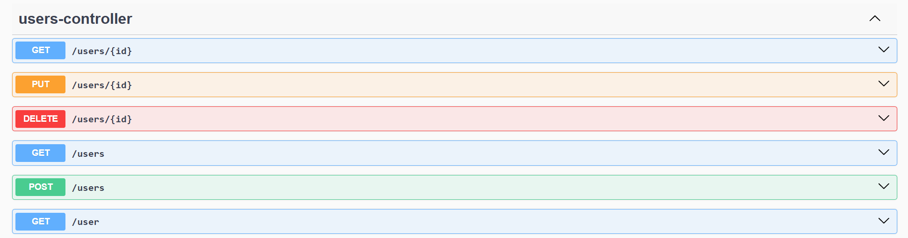
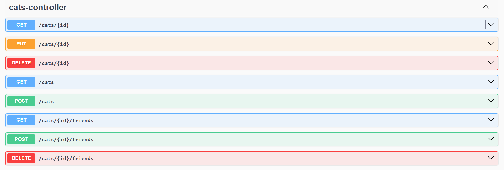
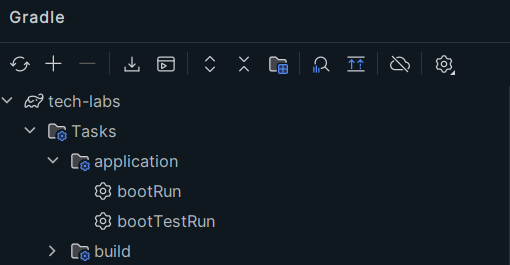

# Cats REST Api App

## Overview

Небольшое приложение для хранения информации о пользователях и котах,
сделанное на основе Spring MVC с использованием Spring Boot.
 

- Есть разделение на роли: ADMIN и USER (Spring Security - Basic Auth без Session Management)
- ADMIN регистрирует новых пользователей и управляет информацией о них
- и USER, и ADMIN могут управлять котами: регистрировать и удалять их,
  редактировать информацию, добавлять других котов в список друзей для своего кота,
  удалять кота из списка друзей
- Код разделён на gradle-модули, соответствующие common, dao, service, presentation слоям

## Схема БД

## Список доступных методов

## Запуск приложения

Для сборки и запуска приложения достаточно запустить с помощью gradle
task bootRun (gradle wrapper есть в репозитории, также должны быть установлены Docker и JDK 17),
все нужные значения уже есть в файлах .env (для docker-compose) и application.properties.
 
По дефолту сервер слушает порт 7070
 

